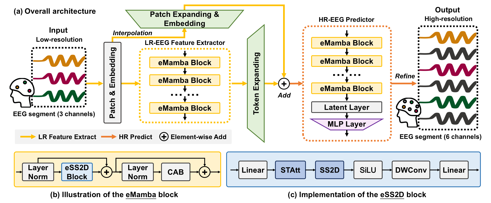

# MASER: Enhancing EEG Spatial Resolution with State Space Modeling
[](LICENSE)
[](https://python.org)
[](https://doi.org/10.1109/TNSRE.2024.3481886)

This repository contains the official implementation code for the paper **"MASER: Enhancing EEG Spatial Resolution With State Space Modeling"** published in IEEE Transactions on Neural Systems and Rehabilitation Engineering, 2024.




## Project Highlights

- **🎯 Novel SSM Architecture**: First work to introduce State Space Models (SSMs) for EEG spatial super-resolution, pioneering EEG-oriented state space modeling
- **🚀 Superior Performance**: Achieves state-of-the-art results with 16.25% reduction in nMSE and 1.13% improvement in Pearson correlation, supporting 2x, 4x, and 8x super-resolution across various electrode configurations.
- **🧠 Practical Impact**: Demonstrates 5.74% improvement in motor imagery recognition accuracy with 4x spatial resolution enhancement, promising high-quality EEG analysis using consumer-grade devices with fewer electrodes.


## Directory Structure
```
maser_code/
│── base
│   ├── dataset.py
│   ├── modelMM.py
│   ├── ssm.py
│   └── util.py
├── ckpt
│   └── last.ckpt
├── config
│   └── case2-4x-MM-state8-Mdep2.yml
├── data
│   └── test_data.dat
├── inference.py
├── readme.md
└── requirements.txt
```
## Prerequisites

- **Operating System**: Linux (recommended) or Windows with WSL
- **Python**: 3.8 or higher
- **CUDA**: Compatible GPU with CUDA support (for optimal performance)


## Installation

1. Download and enter the repository:
```commandline
git clone https://github.com/YOUR_USERNAME/MASER-EEGSR.git
cd MASER-EEGSR
```

2. Create a conda environment (recommended):
```commandline
conda create -n maser_env python=3.8
conda activate maser_env
```
3. Install the required packages:
```commandline
pip install -r requirements.txt
```

Note: Some packages may require additional system dependencies. If you encounter issues, please refer to the individual package documentation.

4. Special Installation Instructions:

Please follow the official installation instructions for these packages:
- [causal_conv1d](https://github.com/Dao-AILab/causal-conv1d/releases/)
- [mamba_ssm](https://github.com/state-spaces/mamba/releases)

These packages may require a Linux environment and additional system dependencies. Please ensure you're using a compatible system and have the necessary build tools installed.


## Quick Start

1. First download the [test data](https://drive.google.com/file/d/1aJSEMKBU_RT7-L8h1iNJ24q-NNCUswpX/view?usp=sharing) and place it in `maser_code/data/test_data.dat`

2. To run the example inference code:
```commandline
python inference.py
```

This will demonstrate the 4x super-resolution capabilities of MASER on the PhysioNet MM/I dataset under case 2 conditions using the provided test data and pre-trained checkpoint model.

## Citation
If you use this code in your research, please cite our paper:

```bibtex
@article{zhang2024maser,
    title={MASER: Enhancing EEG Spatial Resolution With State Space Modeling},
    author={Zhang, Yifan and Yu, Yang and Li, Hao and Wu, Anqi and Zeng, Ling-Li and Hu, Dewen},
    journal={IEEE Transactions on Neural Systems and Rehabilitation Engineering},
    volume={32},
    pages={3858--3868},
    year={2024},
    doi={10.1109/TNSRE.2024.3481886},
}
```

## Acknowledgments
- **Datasets**: [SEED Emotion Database (SJTU)](https://bcmi.sjtu.edu.cn/home/seed/), [PhysioNet Motor Movement/Imagery Database](https://physionet.org/content/eegmmidb/1.0.0/)
- **Funding**: STI 2030-Major Projects (2022ZD0208903), National Natural Science Foundation of China (62036013, 62006239, 61722313), Science and Technology Innovation Program of Hunan Province (2023RC1004)
